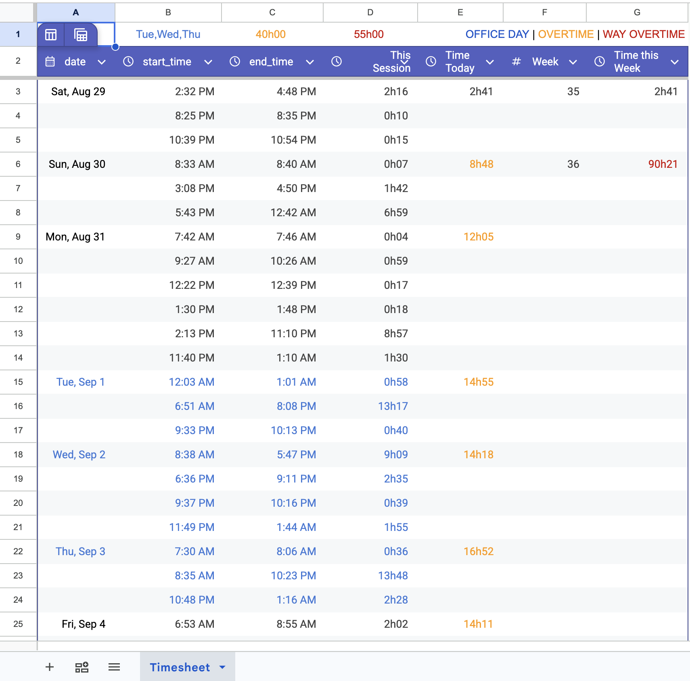

# active-time

Turns a Mac's keyboard and trackpad activity log into an automatic timesheet, synced to a Google Sheet — no manual time tracking required.

## Motivation

I worked a consulting gig billed by the hour, on a laptop used for nothing else. I needed to track my hours. Timesheets require starting a timer, stopping it, and remembering to do both. I often forgot, which meant guessing or losing money.

## How it works

macOS keeps a log of keyboard and trackpad activity. It uses this log to decide when to dim the screen or go to sleep. That log already contains the information a timesheet needs: when the laptop was actually being used.

So instead of tracking hours by hand, this project read that log and built work sessions from it directly. No timer, no manual entry.

## Workflow

1. Read the log, either live (`pmset -g log`) or from a saved file.
2. Filtered out background noise — wake-ups, notifications, video calls — and kept only real keyboard, trackpad, and lid events.
3. Grouped nearby activity into sessions. A gap under 20 minutes (configurable) didn't count as a break.
4. Wrote the result to a CSV, and optionally to a Google Sheet, so the data didn't depend on one laptop.
5. Ran once a day on its own, using `launchd`, macOS's built-in scheduler.

## Output

A simple list: date, start time, end time.

```
date,start_time,end_time
2026-09-05,08:09,13:12
2026-09-05,13:35,17:11
```

A separate spreadsheet used that data to calculate daily and weekly totals and flag overtime.



## Engineering notes

- macOS logs when an activity window expires, not when the last real keystroke happened. The gap between those two could be minutes or over an hour, so the script had to subtract it out.
- A laptop that briefly slept and woke back up shouldn't have counted as the end of a session. Treating it that way discarded real activity.
- Google Sheets changes how values are formatted when read back — for example, dropping a leading zero from a time. Comparing raw text missed this and created duplicate rows. Values had to be normalized before comparing.

## Privacy

The log only records whether input happened, not what was typed or which apps were used. No keystrokes, no app names, no screenshots.

## Installation

See [`SETUP.md`](SETUP.md) for installation, the optional Google Sheet sync setup, and scheduling details.
